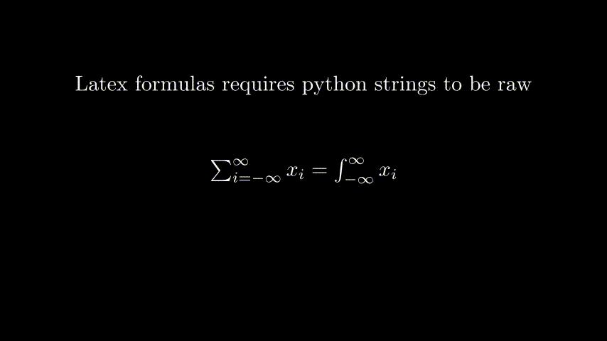

Latex Formulas can be written as TextMobjects. Some important points:
- The latex syntax remains, i.e., equations should be written within $ or $$
- Every code that has a backlash has to be escaped with another backlash, i.e., `\frac{a}{b}` should be `\\frac{a}{b}` OR one can use python's `string literals`, i.e., strings should be written as `r'$\frac{a}{b}$'`{.python}

See the example below:

```python
from manimlib.imports import Scene, TextMobject, UP


class SimpleFormula(Scene):
    """
    Formulas are just simple text written as Latex formulas.

    Some notes:
    - strings have to be raw to accept backlashes (\) or you have 
    to escape a backlash with another backlash (\\)
    - prepend \displaystyle to show formulas in a better size
    - you can fragment formulas as several arguments of a TextMObject
    """
    def construct(self):
        
        formula = TextMobject(
            r'$\sum_{i=-\infty}^\infty x_i = \int_{-\infty}^\infty x_i$'
            )

        formula2 = TextMobject(
            r'$\displaystyle\sum_{i=-\infty}^\infty x_i = \int_{-\infty}^\infty x_i$'
        )
        formula3 = TextMobject('a','+','b')
        

        text = TextMobject('Latex formulas requires python strings to be raw')
        text2 = TextMobject(r'For example: r"$...$"')
        text3 = TextMobject(r'Using \\displaystyle the formula gets prettier...')

        text.move_to(2 * UP)
        text2.move_to(2 * UP)
        text3.move_to(2 * UP)

        self.add(formula); self.add(text); 
        self.wait(2); self.remove(text); 
        
        self.add(text2); self.wait(2)
        self.remove(text2); self.remove(formula);
        
        self.add(text3); self.add(formula2); 
        self.wait(2); self.remove(formula2); 
        
        self.add(formula3); self.wait(2);
```

> After running `manim filename.py SimpleFormula -ps`, you'll obtain the following result:
<p align='center'> </p>
