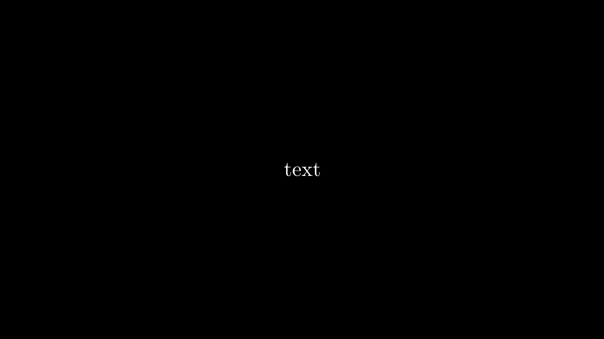

## Simple static image

To create a simple static image of a text, just create a class, inherit from the `Scene` class and define a `construct` method.

```python
from manimlib.imports import Scene, TextMobject


class StaticImage(Scene):
	'''Create a text using a Text Manin Object.'''
	def construct(self):
		text = TextMobject('text')
		self.add(text)
``` 
After running `manim filename.py StaticImage -ps`, you'll obtain the following result:
<p align='left'> </p>