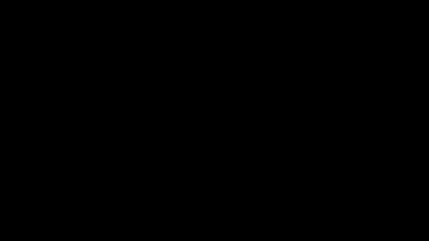

Another usefull shape for identifying formulas is the `SurroundingRectangle`.
In this example, we are creating a formula using `TexMobject`, separating its parts into `VGroups` and applying a `SurroundingRectangle` to them. Moreover, we are specifying a color for the second surrounding frame and applying a `Transform`ation from `box1` to `box2` via a specific `path_arc` and `run_time` delay.

```python
from manimlib.imports import *


class SurroundingRect(Scene):

    def construct(self):
        navier_stokes = TexMobject(
            '\\rho',
            '{D',
            '\\textbf{u}',
            '\\over Dt}',
            '=',
            '\\rho',
            '\\left(',
            '{\\partial',
            '\\textbf{u}',
            '\\over \\partial t}',
            '+',
            '\\textbf{u}',
            '\\cdot',
            '\\Delta',
            '\\textbf{u}',
            '\\right)'
        )
        total_derivative = VGroup(navier_stokes[1:4])
        expanded_derivative = VGroup(navier_stokes[6:])

        box1 = SurroundingRectangle(total_derivative)
        box2 = SurroundingRectangle(expanded_derivative)

        box2.set_color(BLUE)

        self.play(Write(navier_stokes))
        self.wait(2)
        self.play(ShowCreation(box1))
        self.wait()
        self.play(
            Transform(box1, box2),
            path_arc = -3.1415,
            run_time = 2
        )
        self.wait(2)
        

```

After running `manim filename.py -pl`, you'll obtain the following result (which was converted to gif using [this bash script](https://github.com/aguiarandre/manim-training/blob/master/makegif.sh)):
<p align='center'> </p>