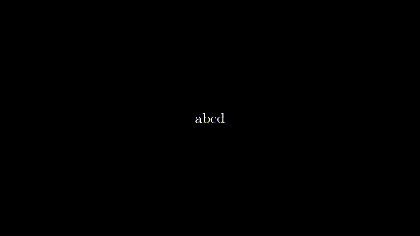

Both the `Text` and `Tex` Mobjects allows for multiple arguments. If you use multiple arguments to initialize the Text (or Tex) Mobject, the resulting variable will be an array of elements, which, individually, will have their own methods.

So for instance, if you declare `text = TextMobject('x' ,'y')`, you'll be able to specifically deal with `text[0]`, which will represent `'x'` and `text[1]`, which will represent `'y'`.

You can also deal with latex formulas. For example, if you declare `formula = TexMobject('x', '\\over', 'y')`, you'll be able to specify colors and more for each of `formula[0]`, `formula[1]` and `formula[2]`, which will represent the `'x'`, the symbol of division and the `'y'`.

Check the examples below for color setting for each of the objects created.

```python
from manimlib.imports import Scene, TextMobject, TexMobject
from manimlib.imports import BLUE, RED, GREEN, ORANGE, YELLOW, PINK

class Array(Scene):

    def construct(self):
        # This syntax leads to an array
        text = TextMobject('a','b', 'c', 'd')

        self.add(text)
        self.wait(2)

        text[0].set_color(BLUE)
        text[1].set_color(BLUE)
        text[2].set_color(RED)
        text[3].set_color('#6fbf8a')

        self.add(text)
        self.wait(2)

        #NOTE that here we're using TexMobject and not TextMobject 
        # (mind the t)

        formula = TexMobject('x','=','{a', '\\over','b}')
        formula[0].set_color(RED)
        formula[1].set_color(BLUE)
        formula[2].set_color(PINK)
        formula[3].set_color(YELLOW)
        formula[4].set_color(ORANGE)

        self.remove(text)
        self.add(formula)
        self.wait(2)
```

After running `manim filename.py Array -pl`, you'll obtain the following result:
<p align='left'> </p>